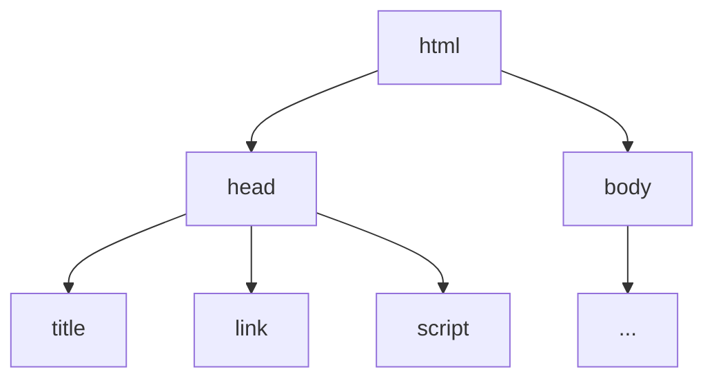

Welcome to **GWC** + **Beavers Code (ACM @ CCNY)**

# Web Workshop

<!--
  My name is Lemuel, I am also a student at CCNY, and have been in the space of web development for a while now (almost half my life [help me]).

  And like most online tech spaces, everything is *always* changing, and it feels important to keep up with the latest trends and technologies.
  It's important to know what's out there and what's possible, but it's also good to stick with what you know if it works for you.
 -->


---
clicks: 1
---

<div class="flex items-center justify-between">

  {class="pr-30"}

  <box v-click class="grid text-6xl grid-cols-2 border-purple bg-purple bg-opacity-20 my-20 mx-auto">
    <logos-html-5 :class="['rotate-20', { 'animate-zoom-in-left': $clicks > 0 }]" />
    <logos-css-3 :class="['rotate--15', { 'animate-zoom-in-right': $clicks > 0 }]" />
    <logos-javascript :class="['rotate--20 [grid-column:1/-1]', { 'animate-zoom-in-up': $clicks > 0 }]" />
  </box>
</div>

<!--
  We'll be making a TODO app, a website that lets you add, remove, edit, and complete tasks.

  To do this, we'll learn about HTML, CSS, and JavaScript, and how they work together to create a website.
 -->

---
clicks: 3
---

<game-icons-grab
  v-click="1"
  :class="[
    'absolute', 'top-15', 'left-15', 'text-9xl', 'text-[#9394d2]',
    { 'animate-tada': $clicks > 0, 'opacity-20': $clicks > 2 }
  ]"
/>
<arrow v-click="2" x1="375" y1="300" x2="600" y2="300" width="5" />

<div
  v-click="1"
  :class="[
    'flex', 'justify-around', 'text-6xl', 'absolute' ,'w-full' ,'top-30', 'left-0', 'transition-opacity',
    { 'opacity-20': $clicks > 2 }
  ]"
>
  <box class="grid grid-cols-2 border-purple bg-purple bg-opacity-20">
    <logos-vue class="rotate-20" />
    <logos-react class="rotate-15" />
    <logos-solidjs-icon class="rotate--20" />
    <logos-angular-icon class="rotate--15" />
  </box>

  <box v-click="2" class="grid grid-cols-2 border-purple bg-purple bg-opacity-20">
    <logos-html-5 class="rotate-20" />
    <logos-css-3 class=" rotate--15" />
    <logos-javascript class="rotate--20 [grid-column:1/-1]" />
  </box>
</div>

<div v-click="3" class="flex justify-around text-8xl absolute w-full top-60 left-0">
  <box class="flex flex-col border-blue bg-blue bg-opacity-20">
    <icon-park-gps class="rotate--20" />
    <span class="text-2xl">GPS</span>
  </box>

  <box class="flex flex-col border-blue bg-blue bg-opacity-20">
    <icon-park-map-draw class="rotate-20" />
    <span class="text-2xl">MAP</span>
  </box>
</div>

<!--
  Most of "Big Tech" and all the companies you know are using a **framework** or **library**
  to build their websites, that makes some of the complicated stuff easier to do.

  Whatever they use, it all eventually get converted into HTML, CSS, and JavaScript.

  Think of it like using a GPS instead of a traditional map, and it's a good thing because it lets you focus on more important things.

  In the same analogy, today you'll learn how the GPS works, so you can understand how to use the map better.

  Oh, but first, a poll.

  - How many of you have no experience in web development?
  - How many of you have some experience in web development?
  - Beginner, Intermediate, Advanced?
 -->

---
layout: fact
---

[bit.ly/ccny-web-workshop](https://bit.ly/ccny-web-workshop){class="text-4xl font-bold"}

<!--
  I've set up a template to use that has basic the functions for adding, removing, and completing tasks.

  I'll be explaining the how the existing code works, but I want you to style the your version of the website
  yourself, and decide with me what new features we should add later on, and how we should implement them.
 -->

---
layout: two-cols
---

```html {all|2|12|3|8|9|11|all|6|7|4|all}{lines: true}
<!DOCTYPE html>
<html>
    <head>
        <title>TODO</title>

        <link rel="stylesheet" href="styles.css" />
        <script type="module" src="script.js"></script>
    </head>
    <body>
        ...
    </body>
</html>
```

<v-click>



</v-click>

<!--
  We have less than an hour, so bare with me.

  This is part of the template `index.html` file that you should be starting with.
  Except for the `...` part, that's just me cutting out the rest.

  Tags are used to structure content, they have a start and end tag, and can have attributes.
  You can see the start and end tags for the `html`, `head`, and `body` tags.

  And self-closing tags, like the `link` tag, which is used to link to an outside file, in this case, our `styles.css`.
  The `script` tag specifically to load our `script.js` file, which is where we write the JavaScript, the ".js".

  And the `title` tag is used to set the title of the website, which is what you see in the tab of your browser.

  The `rel=`, `href=`, `type=`, and `src=` are attributes, and they are used to add information about the tag.

  Tags have a parent-child relationship, and in this case, the `head` tag is the parent of the `title`, `link`, and `script` tags.
  Yes, they're single parents, I know, but that's just the terminology for it. Don't ask how tags...

  Questions? Not about the last part, please.
 -->

---

```html {3-5|6-24|7,10|8|9|12|14,23|15,22|16,19|17|18|21|all|15-22}{lines: true}
<!DOCTYPE html>
<html>
    <head>
      ...
    </head>
    <body>
        <div>
            <input id="text-input" placeholder="What to do..." />
            <button id="add-button" type="submit">Add</button>
        </div>

        <ul id="todo-list"></ul>

        <template id="todo-item-template">
            <li class="todo-item">
                <label class="todo-item-label">
                    <input class="todo-item-checkbox" type="checkbox" />
                    <span class="todo-item-content"></span>
                </label>

                <button class="remove-button">Remove</button>
            </li>
        </template>
    </body>
</html>
```

<!--
  So all the stuff in the `head` tag is not **visible** on the website, but instead
  provides information about the website, like the title, and links to other files.

  The `body` tag is where all the REAL content of the website goes. So here's the rundown:

  - The `div` tag is used to group tags together, and here it's used to group the input and button.
  - The `input` tag here is used to get written text from the user.
  - The `button` tag is a button. You can click it.
  - The `ul` tag is for unordered lists, it's empty for now, but we'll use it to store our tasks.
  - The `template` tag is not visible on the website, it's used to store tags that we can make copies of later.
  - The `li` tag is for list items.
  - The `label` tag is used to create a label for `input` tag with text.
  - The `input` tag here is also used to create a checkbox, the `input` tag is used for a lot of things.
  - The `span` tag is just used to structure text. It's empty, but we'll also use it to store our tasks.
  - Another button.

  It's a lot of tags, but most of them are just for semantics which important for
  accessibility, search engines, and not getting yelled at by your coworkers.

  You can see that all tags have either an `id` or `class` attribute.
  The `id` attribute is used to identify one specific tag that is unique. No more than one tag can have the same id.
  The `class` attribute is used to categorize tags, meaning and multiple tags can have the same class.

  The only tags using classes are the tags inside the `template` tag, and that's because we'll be making copies of them later, so there
  would be multiple of them.

  `id` and `class` attributes are used for query selectors, which are used in both CSS and JavaScript to select one or more tag.
  -->

---
layout: two-cols
---

```css {15-34|15,20|22,26|28,34|15-34}{lines: true, startLine: 13}
...

label {
    display: flex;
    flex-direction: column;
    align-items: center;
    gap: 0.5rem;
}

#todo-list {
    padding: 0;
    list-style-type: none;
    min-width: 30rem;
}

.todo-item {
    display: flex;
    flex-direction: row;
    justify-content: space-between;
    gap: 1rem;
    padding: 0.5rem;
}

...
```

{class="w-100"}

<!--
  This is some of the CSS that's in the `styles.css` file.

  Here, we have three kinds of selectors, the tag selector, the id selector, and the class selector.

  The tag selector is used to select all tags of a certain type, and here it's used to select all `label` tags.

  The id selector, starts with a `#`, and used to select the one and only one tag with the id `todo-list`.
  In this case, it's used to select the `ul` tag.

  The class selector, starts with a `.`, and is used to select all tags with the class `todo-item`.
  In this case, it's used to select all our `li` tags with the class `todo-item`.

  I won't go into detail about the properties *yet*, but you can sort of see that they're used to change the size and positioning of the tags.
  We'll revisit this once we start adding new things to the website.
 -->

---
layout: two-cols
---

```js {1-4|2,9,21|2,9-21|6|1-2,6,9-14,21|1-2,6,9-17,21|1-2,6-7,9-17,21|1-2,6-7,9-20,21}{lines: true}
let textInput = document.querySelector("#text-input");
let addButton = document.querySelector("#add-button");
let todoList = document.querySelector("#todo-list");
let todoItemTemplate = document.querySelector("#todo-item-template");

let state = [];
loadState();

addButton.addEventListener("click", function() {
	let task = {
		id: Date.now(),
		content: textInput.value,
		checked: false
	};

	state.push(task);
	saveState();

	let todoItem = createItemElement(task);
	todoList.append(todoItem);
});

// ...
```

<task />


<!--
  This is some of the JavaScript that's in the `script.js` file.

  The first four lines are used to select the tags we want to interact with, and store them in variables.

  Using the `addButton` variable, we add an event listener to the button, so that when it's clicked, a function runs,
  that in the end, adds a new task to the list.

  So, to start, "state" is a list that stores all our tasks, and it's used to keep track of what tasks are added, removed, and completed.
  Each task is an object, and has an id, content, and checked property.
  The id is used to uniquely identify the task, and uses the `Date.now()` function to get the current time in milliseconds as the id.
  The content is the text of the task, it gets it from the input tag by using the `value` property of the `textInput` variable.
  The checked property is used to keep track of whether the task is completed or not, and is set to `false` by default.

  After the task is created, it's added to the `state` list, and then saved to the browser's local storage.
  So, if you refresh the page, all the tasks and their states are still there.

  In fact, the `loadState` function runs when the website starts, and it's used to load the state from the local storage.

  The `createItemElement` function turns the task object into an HTML element, and then it's added to the `todoList` tag using the `append` function.
  I'm going to be using "element" and "tag" interchangeably from now on.

 -->


---
layout: two-cols
---

```js
function createItemElement(item) {
	let todoItemTemplate = document.querySelector("#todo-item-template");
	let todoItem = todoItemTemplate.content.cloneNode(true);
	let listItem = todoItem.firstElementChild;

	let content = todoItem.querySelector(".todo-item-content");
	content.textContent = item.content;

	let checkbox = todoItem.querySelector(".todo-item-checkbox");
	checkbox.checked = item.checked;
	checkbox.addEventListener("input", function() {
		item.checked = checkbox.checked;
		saveState();
	});

	let removeButton = todoItem.querySelector(".remove-button");
	removeButton.addEventListener("click", function() {
		state = state.filter(function(listItem) {
			return listItem.id !== item.id;
		});
		saveState();

		listItem.remove();
	});

	return todoItem;
}
```

---

# Behavior

<!--
  I'm going to start using JavaScript by talking about the control flow of what we want our website to do, rather than the means of how we're going to do it.
 -->

<!--
  So, what was the point of having an intermediate state between our HTML and JavaScript?
 -->

 <!--
  Why render everything all over again?

  Operations such as removing, editing, and checking if a task is completed, all require DOM manipulation, and that means, so does our load function.


  -->


---

# The Render Loop

<!--
  So, the render loop is kinda bad, because it's not efficient, and it's not scalable.
   -->
